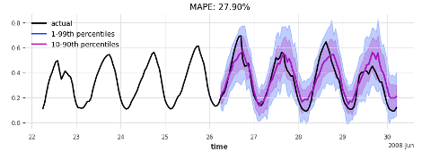

energy_forecasting
==============================

Experiments on community dataset [^1] regarding energy demand/generation forecasting with uncertainty-aware deep learning models. Data are sourced from [Global Energy Forecasting Competition 2012 - Load Forecasting](https://www.kaggle.com/competitions/global-energy-forecasting-competition-2012-load-forecasting/overview) and [Global Energy Forecasting Competition 2012 - wind power Forecasting](https://www.kaggle.com/competitions/GEF2012-wind-forecasting/data).
Correspoing Jupyter notebooks can be found in the directory `notebooks`.


## *highlights*

- [x] uncertainty-aware DL modelling;
- [x] seq2seq


## Temporal fusion transformer model 

An TFT model with desired interpretability is built.

[](visualisations/Picture1.png)


## LSTM Autoencoder

An LSTM AutoEncoder model is built for comparison purpose.




## installation

Some library codes for preprocessing and building models can be installed locally for convenience. For installing[^2]

```shell
pip install .
```


### caveats

Currently these models are only trained for 1 epoch for demonstration purposes. Hyper-parameter tuning will be done in the future.


### reference

--------
[^1]: Created by [Yu Chen](https://yuchenakaleslie.github.io/);
[^2]: Project based on the <a target="_blank" href="https://drivendata.github.io/cookiecutter-data-science/">cookiecutter data science project template</a>. 